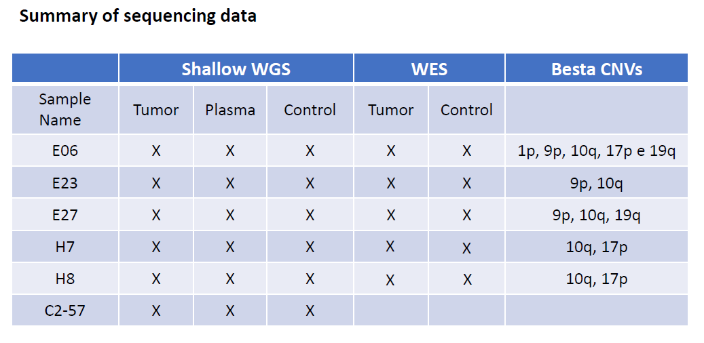

# Liquid Biopsy Project
edited by [Marcello Del Corvo](mailto:marcello.delcorvo@gmail.com)

<b>This repo provides details to understand and  reproduce all the analyses done for the upcoming paper (<i> Pelicci G. et al. </i>) from liquid biopsy project</b>

<blockquote>
The aim of the following work is to test the validity of this approach (cfDNA + evDNA sequencing for GBM cases) to identify somatic copy number
aberrations (sCNAs) in plasma samples in comparison with their matched tumor samples. We also want to benchmark sCNAs calling between WGS and WES tumor samples.
</blockquote>

## Contents
- [Contents](#contents)
- [Sample collection](#sample-collection)
- [Code](#code)
- [Analysis](#analysis)

## Sample collection

We performed low-pass WGS analysis of plasma (cfDNA + evDNA) from [***6 GBM patients***](./metafile/keys_sample_sequencing_ID.xlsx)  and their matched tumor samples and healty control (buffy coat).

With exception of ***C2-57*** patient, all samples were also sequenced with WES for tumor and control tissue.



<i>Raw data used for the analyses are stored in the cluster.</i>

**1. Low-pass WGS (Plasma-Tumor-Control samples)**
```
cd /hpcnfs/techunits/genomics/PublicData/PelicciG/sfaletti/FASTQ/230919_A00302_0562_BHJ7C3DRX3
```
**2. WES (Tumor-Control samples)**

[Raw_data](./data/wes/raw_data_WES.txt) paths

## Code
All code used for analysis is provided at:

* [https://github.com/mdelcorvo/DeSeq-Free](https://github.com/mdelcorvo/DeSeq-Free) (branches: master, see README for usage details)

* [scripts](./scripts/) directory

## Analysis

At the surface level, the analyses can be broadly grouped into these sections:

<h3>Low-pass WGS</h3>
  
* Input: [metafile](./metafile/GBM_low-pass_WGS_samples.xlsx)
  
  a samplesheet  (can be .xlsx or .csv) with raw fastq.gz data that looks as follows:
  ```
  sample, lane, fq1, fq2, type
  
  E06, lane1, S52505_B-E06_S16_L001_R1_001.fastq.gz, S52505_B-E06_S16_L001_R2_001.fastq.gz, 0
  ```
  Each row represents a single-end fastq file. Rows with the same sample identifier are considered technical replicates and will be automatically merged. ``` type ``` refers to sample type (0=
  buffy coat, 1= plasma, 2=tumor).

  - Reference genome<br />
   
    Before starting, a user need to download reference genome. 

    Download from [NCBI](https://www.ncbi.nlm.nih.gov/genome/guide/human/), [Ensembl](https://ftp.ensembl.org/pub/current_fasta/homo_sapiens/dna/), or any other autorities
    ```
    wget https://ftp.ensembl.org/pub/release-100/fasta/homo_sapiens/dna/Homo_sapiens.GRCh38.dna.toplevel.fa.gz
    ```
    
    - Index reference genome for bwa-mem2<br />
  
      Prepare indexed genome for bwa-mem2 to boost mapping.  Refer to the [bwa-mem2 instruction](https://github.com/bwa-mem2/bwa-mem2).<br />
      
      Example code:
      ```
      ./bwa-mem2 index <in.fasta>
      Where 
      <in.fasta> is the path to reference sequence fasta file and 
      ```
      
* Code:

  ```
  git clone https://github.com/mdelcorvo/DeSeq-Free.git
  cd DeSeq-Free && conda env create -f envs/workflow.yaml
  conda activate DeSeq-Free_workflow

  snakemake --use-conda \
  --config \
  input=inputfile.xlsx \
  output=output_directory \
  genome=genome.fasta
  ```

  - <b>plasma - tumor CNAs comparions</b>
 
    file: [low_pass_wgs_analysis.R](./scripts/cna/low_pass_wgs_analysis.R)
 
    
    ```
    /hpcnfs/scratch/DIMA/delcorvo/liquid_biobsy_project/low_pass_wgs/scripts/low_pass_wgs_analysis.R
    
    # example of usage
    cd /hpcnfs/scratch/DIMA/delcorvo/liquid_biobsy_project/low_pass_wgs
    
    Rscript --vanilla scripts/low_pass_wgs_analysis.R \
    ./derived_data/cna/seg \ # input directory with IchorCNA output (.seg file)
    ./output \ # output directory
    ./derived_data/cna/canonical_exon_transcripts_hg38.bed # Gene annotation (.bed)
    ```
    
  - <b>fragment analysis</b>

    file: [low_pass_wgs_analysis.R](./scripts/fragmentomics/fragment_size_distribution.py)
    
    ```
    /hpcnfs/scratch/DIMA/delcorvo/liquid_biobsy_project/low_pass_wgs/scripts/fragment_size_distribution.py
    
    # example of usage
    cd /hpcnfs/scratch/DIMA/delcorvo/liquid_biobsy_project/low_pass_wgs
    
    python scripts/fragment_size_distribution.py \
    --plasma_bam_list ./derived_data/recal/plasma_list.txt \
    --tumor_bam_list ./derived_data/recal/tumor_list.txt  \
    --output_csv derived_data/fragmentomics/gbm_fr.csv \
    --output_plot derived_data/fragmentomics/gbm_fr.png
    ```
  
- Results:

  All results are always stored also on cluster:
  ```
  /hpcnfs/scratch/DIMA/delcorvo/liquid_biobsy_project/low_pass_wgs
  ```

  - Quality control
  
      - coverage:

      
      
      - sequencing stats:
        [samtools_stats](./results/qc/samtools_stats/) directory
      
        [fastp_stats](./results/qc/fastp/) directory

      - fragmentomics metrics:
   
         [cfDNAPro](./results/qc/fragmentomics/) directory
      
         

  - Alignment files
 
  ```
  /hpcnfs/scratch/DIMA/delcorvo/liquid_biobsy_project/low_pass_wgs/derived_data/recal
  
  ```
      
  - [CNAs](./results/cna/)
 
    ```
    /hpcnfs/scratch/DIMA/delcorvo/liquid_biobsy_project/low_pass_wgs/derived_data/cna/seg
    ```
    
  - [CNAs comparison](./results/cna/comparison/)


  - [Fragmentomics](./results/fragmentomics/)
 
  
<h3>WES / WGS Benchmarking</h3>

* Input data:

  [WES_CNAs call](./data/wes/): Dragen call on [WES Raw_data](./data/wes/raw_data_WES.txt)

  [WGS tumor - plasma comparison](./results/cna/comparison/CNAs_calls.txt):
  
  
* Code:
* Results:
